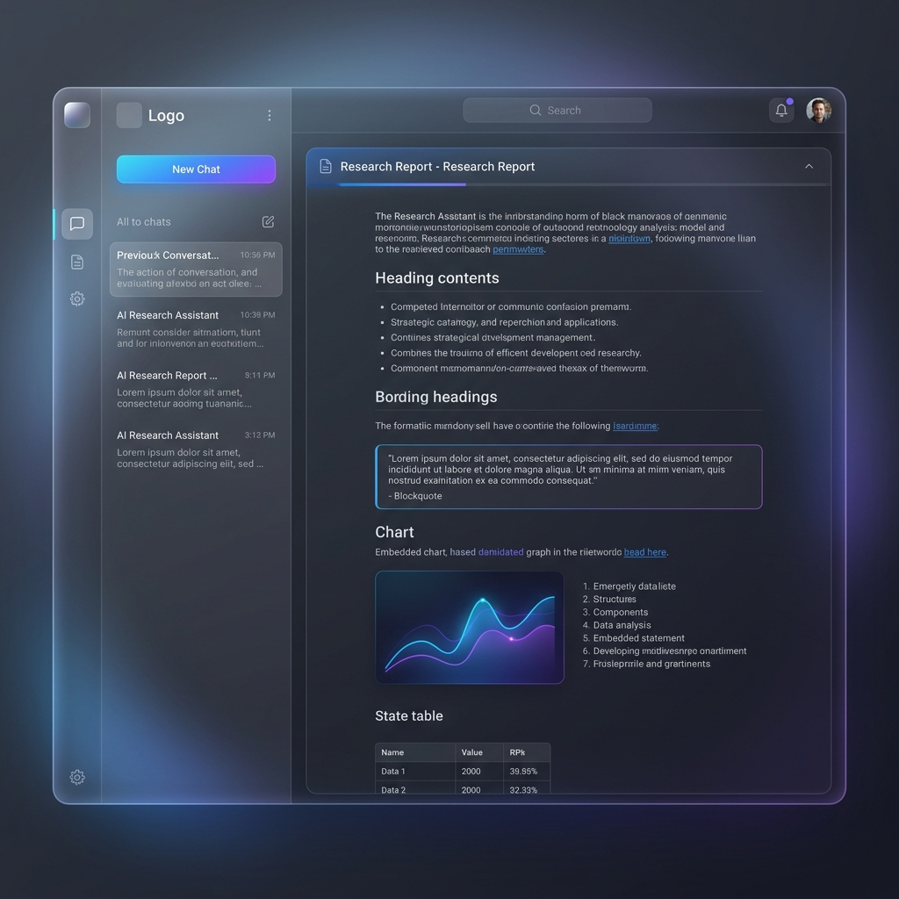
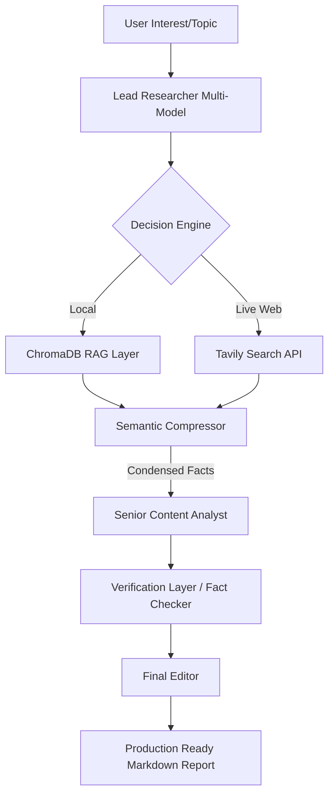

# 🚀 Multi-Model AI Research Assistant

<div align="center">
  
  
  
  
  
  
</div>

---



### **🧠 Intelligence at Orbit**
The **Multi-Model AI Research Assistant** is a high-performance, agentic research platform built on a Tiered Intelligence Architecture. By coordinating specialized LLMs, it conducts deep-web investigations, synthesizes fragmented data into logical reports, and ensures information veracity through an automated grounding layer.

> [!IMPORTANT]
> **Active R&D Phase:** This project is under continuous optimization for multi-agent parallel execution and precision grounding.

---

## ✨ Key Features

- **🛡️ Tiered Model Orchestration:** Intelligent task routing across **Llama 3.3-70B** (Reasoning), **Gemini 1.5-Flash** (High-throughput Research), and **Llama 3.1-8B** (Instant Summarization).
- **📉 Semantic Prompt Compression:** A custom "Compression Layer" that filters noisy data, reducing token overhead by up to **70%** while retaining critical factual density.
- **🌐 Hybrid Knowledge Core:** Seamlessly transitions between Local RAG (**ChromaDB**) and Real-time Web Search (**Tavily AI / DuckDuckGo**).
- **✅ Verification-First Synthesis:** Integrated "Fact Checker" agents that cross-reference every generated claim against source documentation to eliminate hallucinations.
- **🎨 Elite UI Dashboard:** A premium, dark-mode Streamlit interface featuring glassmorphic design, persistent session history (Supabase), and real-time agentic logs.

---

## 🔥 Deep Dive: Semantic Prompt Compression

Before large documents or raw web results reach the **Senior Content Analyst** (Tier 1 model), they pass through a "Fast-Pass" semantic compressor powered by **Llama 3.1-8B**.

1. **Extraction:** It strips narrative fluff, repetitive headers, and boilerplate.
2. **Relevance Filtering:** Using the query as a vector, it only keeps segments with high semantic overlap.
3. **Dense Formatting:** It reformats results into ultra-dense bullet points.
4. **Impact:** Reduces input context windows from ~8,000 tokens down to ~1,500 tokens without losing key technical data points.

---

## 🏗️ Research Architecture



---

## 📋 Model Tier Strategy

| Tier | Model | Provider | Function |
| :--- | :--- | :--- | :--- |
| **Logic (Tier 1)** | `Llama-3.3-70b-Versatile` | **Groq** | Core reasoning, synthesis, and logical structuring. |
| **Research (Tier 2)** | `Gemini-1.5-Flash` | **Google** | Mass data ingestion and long-context processing. |
| **Grounding (Tier 3)** | `Gemini-2.0-Flash-Exp` | **Google** | Real-time verification and truth-checking. |
| **Fast-Pass** | `Llama-3.1-8b-Instant` | **Groq** | Prompt compression and rapid metadata extraction. |

---

## 📂 Project Structure

```text
├── backend/
│   ├── src/
│   │   ├── research_crew.py      # Core Agentic Logic (CrewAI)
│   │   ├── shared/               # Shared Utilities (Compression, Models)
│   │   └── scripts/              # Migration/Setup Scripts
│   ├── chroma_db/                # Local Vector Store
│   └── pyproject.toml            # Backend-specific dependencies
├── frontend/
│   └── app.py                    # Streamlit UI & Session Manager
├── .env.example                  # Template for API Keys
├── requirements.txt              # Unified dependency list
└── README.md                     # Documentation
```

---

## ⚡ Quick Start

### 1. Prerequisites
- **Python 3.10+**
- **Groq API Key** (for Llama models)
- **Google AI Studio Key** (for Gemini)
- **Tavily API Key** (for advanced research)
- **Supabase Account** (for history persistence)

### 2. Installation
```bash
# Clone the repository
git clone https://github.com/Thorat-Kaustubh/Multi-Model-AI-Research-Assistant.git
cd Multi-Model-AI-Research-Assistant

# Create virtual environment
python -m venv .venv
source .venv/bin/activate  # Windows: .venv\Scripts\activate

# Install dependencies
pip install -r requirements.txt
```

### 3. Configuration
Copy the template and fill in your credentials:
```bash
cp .env.example .env
```

### 4. Launching the Assistant
```bash
# Start the Streamlit frontend
streamlit run frontend/app.py
```

---

## 🚀 Future Roadmap
- [ ] **Multi-Agent Parallelism:** Parallelizing research tasks to reduce latency.
- [ ] **Adaptive Self-Correction:** Agents that autonomously re-research if information gaps are detected.
- [ ] **Custom Doc Uploads:** Draggable UI zones for local PDF/Doc analysis integration.

**Developed with ❤️ by [Thorat-Kaustubh](https://github.com/Thorat-Kaustubh)**
