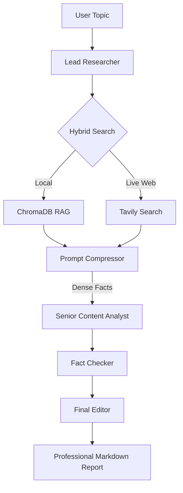

# 🚀 Multi-Model AI Research Assistant

> **⚠️ This project is actively being improved with new features and optimizations.** 

An advanced agentic research intelligence platform that leverages a multi-model tiered architecture to conduct deep-dive investigations, synthesize results, and provide fact-checked reports. This assistant combines the reasoning power of **Meta (Llama 3.3)**, the grounding capabilities of **Google (Gemini)**, and the real-time browsing of **Tavily** into a single cohesive research environment.

---

## 🛠️ Tech Stack & Architecture

### **🧠 AI & Orchestration**
*   **Orchestration Framework:** [CrewAI](https://www.crewai.com/) (Agentic Workflow Control)
*   **Core Reasoning (Tier 1):** `Llama-3.3-70B` (via **Groq**) - High-precision analysis and synthesis.
*   **Research Intelligence (Tier 2):** `Gemini-1.5-Flash` (via **Google AI**) - Deep research and context retrieval.
*   **Grounding & Verification:** `Gemini-2.0-Flash-Exp` - FACT-checking and hallucination prevention.
*   **Compression & Summary:** `Llama-3.1-8B` - Highspeed task summarization and token optimization.

### **🏗️ Infrastructure & Search**
*   **Vector Database:** [ChromaDB](https://www.trychroma.com/) (Local persistent storage for RAG).
*   **Web Search Overlay:** [Tavily AI](https://tavily.com/) (Dedicated AI-optimized web research).
*   **Backend Persistence:** [Supabase](https://supabase.com/) (Chat history, session management, and user metadata).
*   **Frontend UI:** [Streamlit](https://streamlit.io/) (Professional-grade dashboard).

### **⚡ Prompt Compression Logic**
Unique to this project is a **Semantic Prompt Compression Layer**. Before large documents or web results are passed to the deep reasoning model, they are first processed by a high-speed model to extract only critical facts, reducing token usage by up to **70%** and preventing rate-limit bottlenecks.

---

## 🔥 Key Features

- **🌐 Hybrid Knowledge Layer:** Seamlessly alternates between local document indexing (ChromaDB) and live internet research (Tavily).
- **📋 Automated Fact-Checking:** A dedicated "Fact Checker" agent verifies all synthesized claims against raw sources to ensure 100% accuracy.
- **🔄 Tiered Model Strategy:** Distributes workloads across multiple providers (Groq/Google) to optimize for speed, cost, and reliability.
- **🎨 Premium UI Dashboard:** A modern Streamlit interface with multi-thread history support, glassmorphism aesthetics, and real-time research logs.
- **🚀 Active Development:** Currently being optimized for multi-agent parallel execution and tool usage refinement.

---

## 🏗️ Research Architecture



---

## ⚡ Quick Start

### **Environment Setup**
1.  **Clone the Repo:**
    ```bash
    git clone https://github.com/Thorat-Kaustubh/Multi-Model-AI-Research-Assistant.git
    cd Multi-Model-AI-Research-Assistant
    ```
2.  **Configuration:**
    Copy `.env.example` to `.env` and fill in your API keys (Groq, Google, Supabase, Tavily).
3.  **Install Dependencies:**
    ```bash
    pip install -r requirements.txt
    ```
4.  **Run the App:**
    ```bash
    streamlit run frontend/app.py
    ```

---

## ⚠️ Active Project Status
This repository is part of an ongoing R&D initiative in agentic AI. We are currently implementing **Multi-Agent Parallelism** and **Self-Correction Loops** to further improve research accuracy. 

**Maintained by:** [Thorat-Kaustubh](https://github.com/Thorat-Kaustubh)
